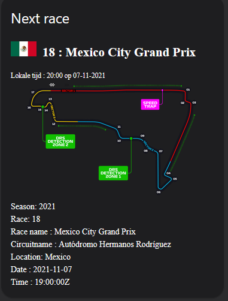
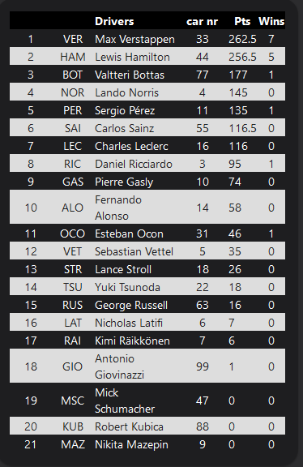

# Frontend Example
The goal is to eventually have a custom lovelace card to display the sensor's information. In the meantime, a makeshift display can be created using template Markdowns.  The font is the Official Formula One and is not the default. Follow the steps below to get a result similar to this:

To display the next race:

 
```
type: markdown
content: >-
     <h2>&nbsp; 
  {{ nr.round }} :  {{ nr.raceName }}</h2>

  <small>Local time : {{ as_timestamp(nr.date + ' ' + nr.time) |
  timestamp_custom("%H:%M on %y-%m-%D ") }}</small>

  <a target="_new" href="{{nr.Circuit.url}}">
    
  </a> <br> 

  Season: {{nr.season}}<br>

  Race: {{nr.round}}<br>

  Race name : {{nr.raceName}}<br>

  Circuit name : {{nr.Circuit.circuitName}}<br>

  Location: {{nr.Circuit.Location.country}}<br>

  Date : {{nr.date}}<br>

  Time : {{nr.time}}<br>  
title: Next race
card_mod:
  style:
    ha-markdown$: |
      * {
        font-family: FormulaOne, "Titillium Web";
      }
```

To display the Driver standings:


```
type: markdown
content: |-
  <table>
    <thead>
      <tr>
        <th>&nbsp;</th>
        <th colspan="2">Drivers</th>
      <th class="center"> Car nr</th>
       <th class="center">Pts</th>
      <th class="center">Wins</th>
      </tr>
    </thead>
    <tbody>
   <tr>
          <td>{{driver.position}}</td>
          <td>{{driver.Driver.code}}</td>
          <td>{{driver.Driver.givenName }} {{driver.Driver.familyName}}</td>
         <td> {{driver.Driver.permanentNumber}}</td>
         <td>{{driver.points}}</td>
        <td><center>{{driver.wins}}</center></td>
      </tr>
  
    </tbody>
  </table>
card_mod:
  style:
    ha-markdown$: |
      table {
        width: 100%;
        border-spacing: 0;
        border-collapse: separate;
      }
      th {
        color: white;
        background: black;
      }
      tr:nth-child(even) {
        background-color: #dddddd;
        color: rgb(33,33,33);
      }
      td:nth-child(1) {
        width: 50px;
        text-align: center;
      }
      td:nth-child(2) {
        width: 50px;
        text-align: center;
      }
      td:nth-child(4) {
        width: 60px;
        text-align: center;
      }

```

To display the Constructor standings:


```
type: markdown
content: >-
  <table>
    <thead>
      <tr>
        <th>&nbsp;</th>
        <th>Constructor</th>
        <th class="center">Pts</th>
        <th class="center">Wins</th>
      </tr>
    </thead>
    <tbody>
  
  <tr>
          <td>{{driver.position}}</td>
          <td>{{driver.Constructor.name }}</td>
          <td>{{driver.points}}</td>
          <td><center>{{driver.wins}}</center></td>
      </tr>
  
    </tbody>
  </table>
card_mod:
  style:
    ha-markdown$: |
      table {
        width: 100%;
        border-spacing: 0;
        border-collapse: separate;
      }
      th {
        color: white;
        background: black;
      }
      tr:nth-child(even) {
        background-color: #dddddd;;
        color: rgb(33,33,33);
      }
      td:nth-child(1) {
        width: 50px;
        text-align: center;
      }
      td:nth-child(2) {
        text-align: left;
      }
      td:nth-child(3) {
        width: 60px;
        text-align: center;
      }

```
To display the Race agenda:


```
type: markdown
content: |-
  <table>
    <thead>
      <tr>
        <th>&nbsp;</th>
        <th>race</th>
        <th class="center">date</th>
       <th class="center">time</th>
      </tr>
    </thead>
    <tbody>
   <tr>
          <td>{{races.round}}</td>
          <td>{{races.raceName}}</td>
          <td>{{races.date}}</td>
          <td>{{races.time}}</td>
      </tr>
  
    </tbody>
  </table>
card_mod:
  style:
    ha-markdown$: |
      table {
        width: 100%;
        border-spacing: 0;
        border-collapse: separate;
      }
      th {
        color: white;
        background: black;
      }
      tr:nth-child(even) {
        background-color: #dddddd;;
        color: rgb(33,33,33);
      }
      td:nth-child(1) {
        width: 50px;
        text-align: center;
      }
      td:nth-child(2) {
        text-align: left;
      }
      td:nth-child(3) {
        width: 60px;
        text-align: center;
      }

```
